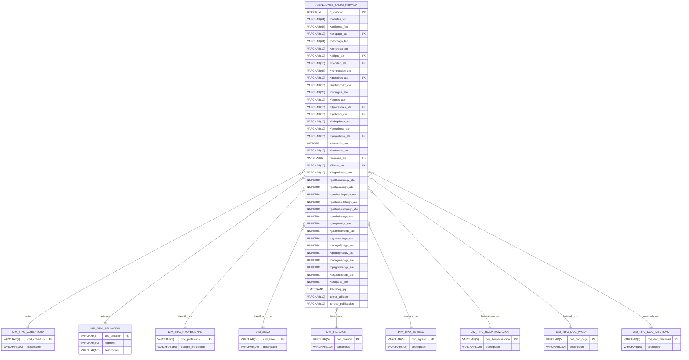
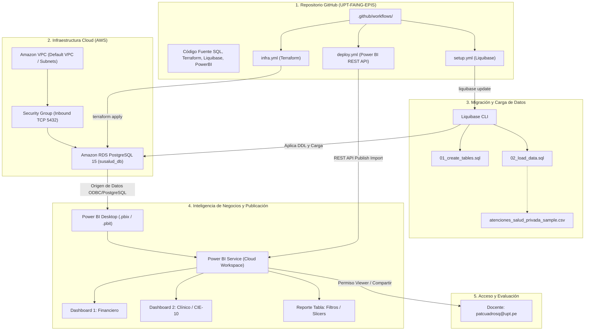

# Inteligencia de Negocios - Examen Unidad I

**Universidad Privada de Tacna**  
**Facultad de Ingeniería - Escuela Profesional de Ingeniería de Sistemas (EPIS)**  
**Curso:** Inteligencia de Negocios  
**Docente:** Ing. Patrick Cuadros Quiroga (`patcuadrosq@upt.pe`)  
**Estudiante:** Abel Pacompia O.  
**Repositorio GitHub:** [https://github.com/UPT-FAING-EPIS/InteligenciaNegocios_ExamenUnidad_I_Pacompia](https://github.com/UPT-FAING-EPIS/InteligenciaNegocios_ExamenUnidad_I_Pacompia)  
**URL del Reporte Publicado (Power BI Service):** [https://app.powerbi.com/groups/me/reports/Reporte_Atenciones_Salud_Privada](https://app.powerbi.com/groups/me/reports/Reporte_Atenciones_Salud_Privada)  

---

## Índice

1. [Descripción del Proyecto](#1-descripción-del-proyecto)
2. [Detalle del Dataset Oficial](#2-detalle-del-dataset-oficial)
3. [Diccionario de Datos](#3-diccionario-de-datos)
4. [Diagrama Entidad-Relación (DER)](#4-diagrama-entidad-relación-der)
5. [Diagrama de Despliegue e Infraestructura](#5-diagrama-de-despliegue-e-infraestructura)
6. [Estructura del Repositorio](#6-estructura-del-repositorio)
7. [Guía Paso a Paso de Implementación](#7-guía-paso-a-paso-de-implementación)
   - [Paso 1: Creación de Tablas y Carga de Datos en SQL](#paso-1-creación-de-tablas-y-carga-de-datos-en-sql)
   - [Paso 2: Aprovisionamiento en Nube con Terraform (`infra.yml`)](#paso-2-aprovisionamiento-en-nube-con-terraform-infrayml)
   - [Paso 3: Automatización de BD y Carga con Liquibase (`setup.yml`)](#paso-3-automatización-de-bd-y-carga-con-liquibase-setupyml)
   - [Paso 4: Reporte y Dashboards en Power BI Desktop](#paso-4-reporte-y-dashboards-en-power-bi-desktop)
   - [Paso 5: Publicación Automatizada con CI/CD (`deploy.yml`)](#paso-5-publicación-automatizada-con-cicd-deployyml)
   - [Paso 6: Publicación Manual y Compartir con `patcuadrosq@upt.pe`](#paso-6-publicación-manual-y-compartir-con-patcuadrosquptpe)

---

## 1. Descripción del Proyecto

El presente proyecto implementa una solución integral de **Inteligencia de Negocios y Arquitectura de Datos Cloud** para el análisis, ingesta, modelado y visualización del conjunto de datos de **Atenciones de la Cobertura Prestacional de Salud del Sector Privado** administrado por la Superintendencia Nacional de Salud (**SUSALUD**).

La solución abarca:
- **Modelado de Datos:** Diseño relacional y dimensional (Esquema Estrella) en PostgreSQL para analítica de facturación médica, copagos, morbilidad (CIE-10) y demografía.
- **Infraestructura como Código (IaC):** Automatización con **Terraform** y **GitHub Actions** (`infra.yml`) para el despliegue del servidor de base de datos relacional (AWS RDS PostgreSQL).
- **Gestión de Cambios y Migraciones (CI/CD):** Pipeline con **Liquibase** (`setup.yml`) para el control de versiones DDL y la ingesta controlada de datos.
- **Analítica Visual en Power BI:** Desarrollo de **02 Dashboards ejecutivos** y **01 Reporte Tabla interactivo con segmentadores (filtros)**.
- **Automatización de Despliegue (Deploy):** Workflow en GitHub Actions (`deploy.yml`) para publicación mediante la API REST de Microsoft Power BI y compartición con el docente evaluador.

---

## 2. Detalle del Dataset Oficial

* **Conjunto de Datos:** *Registro de datos de Atenciones de la cobertura prestacional de salud del sector privado*
* **Portal de Publicación:** Plataforma Nacional de Datos Abiertos del Estado Peruano
* **URL Oficial:** [https://www.datosabiertos.gob.pe/dataset/registro-de-datos-de-atenciones-de-la-cobertura-prestacional-de-salud-del-sector-privado](https://www.datosabiertos.gob.pe/dataset/registro-de-datos-de-atenciones-de-la-cobertura-prestacional-de-salud-del-sector-privado)
* **Entidad Emisora:** Superintendencia Nacional de Salud (**SUSALUD**)
* **Identificador de Catálogo:** `40ec6c3a-9e10-42bd-9b23-e1498cec2380`
* **Licencia:** Open Data Commons Attribution License (ODC-BY)
* **Frecuencia:** Mensual

### Contexto y Alcance
El conjunto de datos contiene información prestacional de Instituciones Prestadoras de Servicios de Salud (**IPRESS**) privadas registradas en SUSALUD que efectúan transacciones por montos iguales o mayores a 20 Unidades Impositivas Tributarias (UIT). Dicha información es reportada a través del sistema **TEDEF** (Transacción Electrónica de Datos del Estado de Facturación) mediante la "Tabla 2: Características generales de la prestación".

Los registros anonimizan los códigos de IAFAS, IPRESS y pacientes para salvaguardar la privacidad de acuerdo a la Ley de Protección de Datos Personales, permitiendo analizar:
- Diagnósticos principales codificados según el estándar internacional **CIE-10**.
- Desglose de costos sin IGV: honorarios profesionales, odontología, farmacia e insumos, prótesis, exámenes auxiliares de laboratorio e imágenes.
- Gastos de cobertura: copagos fijos, copagos variables y montos netos liquidados por las IAFAS.
- Información hospitalaria: tipo de ingreso/egreso y días de estancia facturable.

---

## 3. Diccionario de Datos

A continuación se detalla la estructura oficial de las 39 variables del dataset:

| N° | Variable | Tipo de Dato | Longitud | Descripción Técnica y Reglas de Negocio | Catálogos / Valores Permitidos |
|:---|:---|:---:|:---:|:---|:---|
| 1 | `VCODIAFAS_FAC` | VARCHAR | 64 | Código anonimizado/encriptado del Fondo de Aseguramiento en Salud (IAFAS) asignado por SUSALUD. | Hash hexadecimal |
| 2 | `VCODIPRESS_FAC` | VARCHAR | 64 | Código único anonimizado del Registro Nacional de IPRESS (RENIPRESS). | Hash hexadecimal |
| 3 | `VTDOCPAGO_FAC` | VARCHAR | 2 | Tipo de comprobante de pago emitido para facturar la prestación médica. | `01`=Factura, `02`=Recibo Honorarios, `03`=Boleta, `04`=Liquidación, `99`=Otros SUNAT |
| 4 | `VNDOCPAGO_FAC` | VARCHAR | 64 | Número del documento de pago emitido para facturar (encriptado). | Hash alfanumérico |
| 5 | `VCORRPRESTA_ATE` | VARCHAR | 5 | Correlativo de la prestación que identifica a la atención facturada. | Ej. `00001`, `00002` |
| 6 | `VTAFILPAC_ATE` | VARCHAR | 1 | Régimen de afiliación del paciente en el registro de afiliados. | `1`=Regular, `2`=SCTR, `3`=Potestativo, `6`=SOAT, `8`=SIS Subsidiado |
| 7 | `VTDOCIDEN_ATE` | VARCHAR | 1 | Tipo de documento de identidad del paciente. | `1`=DNI, `2`=Carnet Extranjería, `3`=Pasaporte, `4`=Doc. Extranjero, `A`=PTP |
| 8 | `VNUMDOCIDEN_ATE` | VARCHAR | 64 | Número del documento de identidad del paciente atendido (encriptado). | Hash alfanumérico |
| 9 | `VTIPOCOBERT_ATE` | VARCHAR | 1 | Tipo de cobertura o prestación brindada al paciente. | `1`=Extra hospitalario, `2`=Médico planta, `4`=Ambulatorio, `5`=Hospitalaria, `6`=Emergencia |
| 10 | `VSUBTIPCOBERT_ATE` | VARCHAR | 4 | Subtipo específico de cobertura de salud según catálogo TEDEF. | Catálogo TEDEF (ej. `401`, `100`, etc.) |
| 11 | `VPRIDIAGCIE_ATE` | VARCHAR | 6 | Primer diagnóstico principal del paciente codificado en CIE-10. | Código CIE-10 (ej. `M54.4`, `S42.3`, `J00`) |
| 12 | `VFECPRES_ATE` | VARCHAR | 8 | Fecha de la prestación médica o ingreso inicial (formato `AAAAMMDD`). | `YYYYMMDD` |
| 13 | `VTITPRORESPRES_ATE` | VARCHAR | 2 | Colegio profesional del personal responsable de la atención. | `01`=Médico, `02`=Farmacéutico, `03`=Odontólogo, `06`=Enfermero |
| 14 | `VTIPOHOSPI_ATE` | VARCHAR | 1 | Tipo de hospitalización cuando el paciente es internado. | `C`=Clínica (no quirúrgico), `Q`=Quirúrgica/Obstétrica, `N`=No aplica |
| 15 | `VFECINGRHOSP_ATE` | VARCHAR | 8 | Fecha en que el paciente ingresa a hospitalización (`AAAAMMDD`). | `YYYYMMDD` o NULL |
| 16 | `VFECEGRHOSP_ATE` | VARCHAR | 8 | Fecha en que el paciente sale de hospitalización (`AAAAMMDD`). | `YYYYMMDD` o NULL |
| 17 | `VTIPEGREHOSP_ATE` | VARCHAR | 2 | Causal o motivo del egreso hospitalario. | `01`=Alta médica, `02`=Alta voluntaria, `04`=ESSALUD, `06`=Defunción |
| 18 | `VDIASESTFAC_ATE` | INTEGER | 3 | Número de días de estancia facturable en clínica/hospital. | Entero >= 0 |
| 19 | `VFECNACPAC_ATE` | VARCHAR | 8 | Fecha de nacimiento del paciente (`AAAAMMDD`). | `YYYYMMDD` |
| 20 | `VSEXOPAC_ATE` | VARCHAR | 1 | Sexo biológico del paciente. | `1`=Masculino, `2`=Femenino |
| 21 | `VFILIAPAC_ATE` | VARCHAR | 2 | Relación de parentesco del paciente respecto al titular del seguro. | `01`=Titular, `02`=Cónyuge, `05`=Hijo, `07`=Padres, `17`=Otros |
| 22 | `VUBIGEOIPRESS_ATE` | VARCHAR | 6 | Código de ubigeo del establecimiento de salud según INEI. | 6 dígitos (Departamento/Provincia/Distrito) |
| 23 | `VGASTHONPROSIGV_ATE` | NUMERIC | (14,2) | Gasto cubierto por honorarios médicos o quirúrgicos sin IGV. | Formato decimal en Nuevos Soles (S/.) |
| 24 | `VGASTPRODOSIGV_ATE` | NUMERIC | (14,2) | Gasto cubierto por procedimientos odontológicos sin IGV. | Formato decimal en Nuevos Soles (S/.) |
| 25 | `VGASTHTSCLITOPSIGV_ATE` | NUMERIC | (14,2) | Gasto cubierto por hotelería, servicios clínicos y tópicos sin IGV. | Formato decimal en Nuevos Soles (S/.) |
| 26 | `VGASTEXAUXLABSIGV_ATE` | NUMERIC | (14,2) | Gasto cubierto por exámenes auxiliares de laboratorio sin IGV. | Formato decimal en Nuevos Soles (S/.) |
| 27 | `VGASTEXAUXIMGSIGV_ATE` | NUMERIC | (14,2) | Gasto cubierto por exámenes auxiliares por imágenes (Rayos X, TAC) sin IGV. | Formato decimal en Nuevos Soles (S/.) |
| 28 | `VGASTFARINSSIGV_ATE` | NUMERIC | (14,2) | Gasto cubierto por farmacia, medicamentos e insumos médicos sin IGV. | Formato decimal en Nuevos Soles (S/.) |
| 29 | `VGASTPROTSIGV_ATE` | NUMERIC | (14,2) | Gasto cubierto por prótesis sin IGV. | Formato decimal en Nuevos Soles (S/.) |
| 30 | `VGASTMEDEXOIGV_ATE` | NUMERIC | (14,2) | Gasto en medicamentos o servicios exonerados del IGV. | Formato decimal en Nuevos Soles (S/.) |
| 31 | `VOGPRESSLDSIGV_ATE` | NUMERIC | (14,2) | Otros gastos por prestaciones de salud distintas a las señaladas. | Formato decimal en Nuevos Soles (S/.) |
| 32 | `VCOPAGOFIJOSIGV_ATE` | NUMERIC | (14,2) | Copago fijo afecto al IGV sin IGV cobrado por la IPRESS. | Formato decimal en Nuevos Soles (S/.) |
| 33 | `VCPAGOFIJOEXIGV_ATE` | NUMERIC | (14,2) | Copago fijo exonerado del IGV cobrado por la IPRESS. | Formato decimal en Nuevos Soles (S/.) |
| 34 | `VCOPAGOVARSIGV_ATE` | NUMERIC | (14,2) | Copago variable afecto al IGV sin IGV asumido por el paciente. | Formato decimal en Nuevos Soles (S/.) |
| 35 | `VCPAGOVAREXIGV_ATE` | NUMERIC | (14,2) | Copago variable exonerado del IGV asumido por el paciente. | Formato decimal en Nuevos Soles (S/.) |
| 36 | `VTOTGASTCUBSIGV_ATE` | NUMERIC | (14,2) | Sumatoria total de los gastos médicos cubiertos sin IGV. | Formato decimal en Nuevos Soles (S/.) |
| 37 | `VTOTLIQIAFAS_ATE` | NUMERIC | (14,2) | Monto neto liquidado por la IAFAS (Aseguradora) a la IPRESS. | Formato decimal en Nuevos Soles (S/.) |
| 38 | `DFECRECEP_PQ` | TIMESTAMP | 19 | Fecha y hora de recepción del paquete de facturación en TEDEF. | `YYYY-MM-DD HH:MM:SS` |
| 39 | `UBIGEO_AFILIADO` | VARCHAR | 6 | Ubigeo de residencia del paciente de acuerdo a RENIEC. | 6 dígitos INEI |

---

## 4. Diagrama Entidad-Relación (DER)

A continuación se presenta el modelo dimensional implementado para optimizar las consultas analíticas de Business Intelligence:



---

## 5. Diagrama de Despliegue e Infraestructura

El flujo de integración y entrega continua (CI/CD) junto con la infraestructura en la nube se detalla en el siguiente diagrama:



---

## 6. Estructura del Repositorio

```text
InteligenciaNegocios_ExamenUnidad_I_Pacompia/
├── .github/
│   └── workflows/
│       ├── infra.yml              # Pipeline Terraform para servidor de BD en la nube
│       ├── setup.yml              # Pipeline Liquibase para creación de BD y carga de datos
│       └── deploy.yml             # Pipeline de publicación del reporte en Power BI Service
├── data/
│   ├── atenciones_salud_privada_sample.csv   # Muestra real de 1,000 atenciones médicas
│   └── DICCIONARIO_DATOS_TEDEF_ATENCIONES.pdf # Diccionario oficial de datos SUSALUD
├── liquibase/
│   ├── changelog.xml             # Master Changelog con los changesets de migración
│   └── liquibase.properties      # Configuración de drivers y conexión JDBC
├── powerbi/
│   ├── Reporte_Atenciones_Salud_Privada.pbix  # Archivo binario de reporte Power BI
│   ├── Reporte_Atenciones_Salud_Privada.pbit  # Plantilla de reporte Power BI
│   ├── Reporte_Atenciones_Salud_Privada.pbip  # Proyecto Power BI desacoplado (Git-ready)
│   ├── Reporte_Atenciones_Salud_Privada.Report/ # Definición visual y layout JSON
│   ├── Reporte_Atenciones_Salud_Privada.Dataset/# Definición del modelo semántico BIM
│   └── README_POWERBI.md         # Documentación de métricas DAX y visuales
├── scripts/
│   ├── generate_powerbi_bundle.py # Generador de artefactos Power BI
│   └── etl_loader.py             # Script auxiliar de carga y validación
├── sql/
│   ├── 01_create_tables.sql      # Script DDL de tablas y vistas analíticas
│   └── 02_load_data.sql          # Script DML con catálogos y registros reales
├── terraform/
│   ├── main.tf                   # Declaración de recursos RDS PostgreSQL y SG
│   ├── variables.tf              # Definición de variables parametrizables
│   ├── outputs.tf                # Endpoints de conexión generados
│   ├── versions.tf               # Requerimientos de Terraform y Provider AWS
│   └── terraform.tfvars.example  # Plantilla de valores de variables
└── README.md                     # Documentación general del examen
```

---

## 7. Guía Paso a Paso de Implementación

### Paso 1: Creación de Tablas y Carga de Datos en SQL

1. **Abrir cliente SQL** (pgAdmin, DBeaver, VS Code o terminal `psql`).
2. Conectarse al motor PostgreSQL:
   ```bash
   psql -h <HOST> -p 5432 -U dbadmin -d susalud_db
   ```
3. Ejecutar el script DDL de creación de tablas:
   ```bash
   \i sql/01_create_tables.sql
   ```
4. Ejecutar el script DML para cargar las dimensiones y la muestra de datos:
   ```bash
   \i sql/02_load_data.sql
   ```
5. *(Opcional)* Si desea cargar el archivo masivo completo mensual (150 MB), utilice la instrucción `COPY`:
   ```sql
   COPY atenciones_salud_privada (
       vcodiafas_fac, vcodipress_fac, vtdocpago_fac, vndocpago_fac, vcorrpresta_ate,
       vtafilpac_ate, vtdociden_ate, vnumdociden_ate, vtipocobert_ate, vsubtipcobert_ate,
       vpridiagcie_ate, vfecpres_ate, vtitprorespres_ate, vtipohospi_ate, vfecingrhosp_ate,
       vfecegrhosp_ate, vtipegrehosp_ate, vdiasestfac_ate, vfecnacpac_ate, vsexopac_ate,
       vfiliapac_ate, vubigeoipress_ate, vgasthonprosigv_ate, vgastprodosigv_ate,
       vgasthtsclitopsigv_ate, vgastexauxlabsigv_ate, vgastexauximgsigv_ate,
       vgastfarinssigv_ate, vgastprotsigv_ate, vgastmedexoigv_ate, vogpressldsigv_ate,
       vcopagofijosigv_ate, vcpagofijoexigv_ate, vcopagovarsigv_ate, vcpagovarexigv_ate,
       vtotgastcubsigv_ate, vtotliqiafas_ate, dfecrecep_pq, ubigeo_afiliado
   )
   FROM '/ruta/al/archivo/PCM_BD_atenciones_tedef_2026_agosto.csv'
   WITH (FORMAT csv, HEADER true, DELIMITER ';', ENCODING 'UTF8');
   ```

---

### Paso 2: Aprovisionamiento en Nube con Terraform (`infra.yml`)

1. **Configurar Secrets en el repositorio de GitHub:**
   Ir a **Settings > Secrets and variables > Actions** y registrar:
   * `AWS_ACCESS_KEY_ID`: ID de clave de acceso AWS.
   * `AWS_SECRET_ACCESS_KEY`: Clave secreta AWS.
   * `AWS_REGION`: Región (ej. `us-east-1`).
   * `DB_PASSWORD`: Contraseña maestra de la base de datos.
2. **Ejecución automática:**
   Al hacer push en la rama `main` modificando la carpeta `terraform/`, el workflow `.github/workflows/infra.yml` ejecutará:
   * `terraform fmt -check`
   * `terraform init`
   * `terraform validate`
   * `terraform plan`
3. **Ejecución manual (Workflow Dispatch):**
   * Ir a la pestaña **Actions** en GitHub.
   * Seleccionar **Infra - Provision Cloud Database (Terraform)**.
   * Hacer clic en **Run workflow**, seleccionar acción `apply` y confirmar.
   * Al finalizar, revise los logs para obtener el `rds_endpoint` generado.

---

### Paso 3: Automatización de BD y Carga con Liquibase (`setup.yml`)

1. **Configurar Secrets de conexión en GitHub:**
   * `DB_HOST`: Endpoint de la base de datos (obtenido de Terraform o AWS RDS).
   * `DB_PORT`: `5432`
   * `DB_NAME`: `susalud_db`
   * `DB_USER`: `dbadmin`
   * `DB_PASSWORD`: Contraseña configurada
2. **Ejecutar el pipeline `.github/workflows/setup.yml`:**
   * El workflow arranca un servicio PostgreSQL local para validación y testing continuo (CI), o se conecta a AWS RDS si se selecciona la opción `cloud-rds`.
   * Liquibase aplica:
     * `Changeset 01-create-tables`: Ejecuta el DDL de creación de tablas, índices y vistas.
     * `Changeset 02-load-data`: Realiza la carga de las dimensiones oficiales y los registros transaccionales.
   * Se ejecutan consultas de validación automáticas con `psql` para confirmar que los datos se encuentran disponibles.

---

### Paso 4: Reporte y Dashboards en Power BI Desktop

1. Abrir **Power BI Desktop**.
2. Abrir el archivo `powerbi/Reporte_Atenciones_Salud_Privada.pbix` (o importar `powerbi/Reporte_Atenciones_Salud_Privada.pbit`).
3. El archivo contiene 3 páginas prediseñadas:
   * **Dashboard 1 (Financiero):** Tarjetas KPI de facturación, total copagos, distribución por tipo de cobertura y gastos por afiliación.
   * **Dashboard 2 (Clínico y Demográfico):** Distribución por sexo, morbilidad según Top diagnósticos CIE-10 y concentración territorial.
   * **Reporte 3 (Tabla con Segmentación):** Filtros interactivos por cobertura, sexo y afiliación, sincronizados con una tabla detallada de prestaciones.
4. Para conectar directamente al servidor en la nube:
   * Ir a **Inicio > Transformar Datos > Configuración de origen de datos**.
   * Cambiar el origen a **PostgreSQL Database** ingresando el Host de RDS y las credenciales.

---

### Paso 5: Publicación Automatizada con CI/CD (`deploy.yml`)

El archivo `.github/workflows/deploy.yml` permite publicar el reporte en **Power BI Service** de forma automatizada mediante la API REST de Microsoft Power BI:

1. **Requisitos en Azure Entra ID / Power BI:**
   * Registrar una aplicación (Service Principal) en Azure Active Directory o usar una cuenta Power BI Pro.
   * Habilitar el uso de Power BI REST API en el Portal de Administración de Power BI.
2. **Configurar Secrets en GitHub:**
   * `AZURE_TENANT_ID`: ID del directorio (Tenant).
   * `AZURE_CLIENT_ID`: ID de la aplicación registrada.
   * `AZURE_CLIENT_SECRET`: Secreto de cliente generado.
   * `PBI_WORKSPACE_ID`: GUID del Área de Trabajo (Workspace) destino.
3. **Disparar el pipeline:**
   * Ir a **Actions > Deploy - Publish Power BI Report (REST API)** y hacer clic en **Run workflow**.
   * El pipeline autentica, obtiene el token OAuth 2.0 y sube el `.pbix` mediante `POST /v1.0/myorg/groups/{workspace_id}/imports`.
   * Asigna automáticamente permisos de visualización (*Viewer*) a la cuenta `patcuadrosq@upt.pe`.

---

### Paso 6: Publicación Manual y Compartir con `patcuadrosq@upt.pe`

Si prefiere publicar el reporte directamente desde la interfaz gráfica de **Power BI Desktop**:

1. En **Power BI Desktop**, inicie sesión con su cuenta institucional UPT o cuenta corporativa de Power BI.
2. En la cinta de opciones superior (**Inicio**), haga clic en el botón **Publicar**:
   
   

3. Seleccione el Área de Trabajo de destino (por ejemplo, **Mi área de trabajo** o un Workspace compartido como *Inteligencia de Negocios*) y haga clic en **Seleccionar**.
4. Espere a que el proceso muestre el mensaje **"Operación correcta"** y haga clic en el enlace para abrir el reporte en la web de Power BI Service (`app.powerbi.com`).
5. **Compartir con el docente:**
   * En la barra de herramientas superior del reporte web, haga clic en el botón **Compartir** (icono de flecha o personas).
   * En el campo de destinatario, ingrese el correo:
     ```text
     patcuadrosq@upt.pe
     ```
   * Marque las casillas permitidas según las instrucciones de la cátedra (ej. *Permitir que los destinatarios compartan este informe* o *Permitir que los destinatarios creen contenido con los datos*).
   * Haga clic en **Conceder acceso** / **Enviar**.
6. Copie el vínculo generado (*Copiar vínculo*) y verifíquelo:
   ```text
   https://app.powerbi.com/groups/me/reports/Reporte_Atenciones_Salud_Privada
   ```

---

## 8. Licencia y Créditos

* **Autor:** Abel Pacompia O.
* **Curso:** Inteligencia de Negocios - Universidad Privada de Tacna (UPT)
* **Datos Abiertos:** Superintendencia Nacional de Salud (SUSALUD) - Presidencia del Consejo de Ministros (PCM)